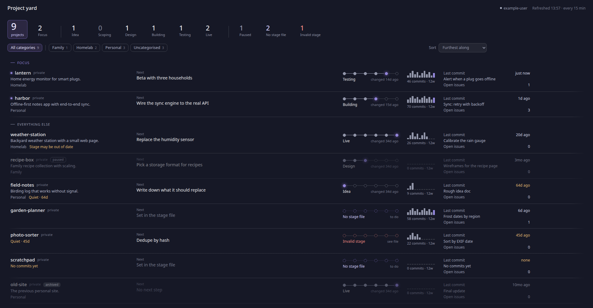

# Project yard

A small self-hosted dashboard that shows every project across your GitHub accounts and orgs:
its stage, next step, and commit activity. It polls GitHub every 15 minutes and serves a
static page. Standard-library Python, no dependencies, one container.

## How it works

- Each repo can have a `.project.toml` at its root with `stage`, `next`, `summary`, `notes`, etc.
  (see `templates/project.toml`). Repos without one still show up, flagged "No stage file".
- Put `templates/global-CLAUDE.md` in `~/.claude/CLAUDE.md` so Claude Code keeps the file current in
  every one of your repos (and only yours; the block names the accounts it applies to).
- Commit activity (12 weeks on the board, 52 on each project's page), recent commits and open
  issues come straight from GitHub.
- If the stage file hasn't changed in `stale_days` but commits have landed since, the dashboard
  flags the stage as possibly out of date.
- If a token fails, a banner says so and the board keeps showing the last good data for that source.
- Narrow windows (560px or less, e.g. a desktop panel popup) get a compact layout.

## 1. Create a token (per account or org)

GitHub → Settings → Developer settings → Fine-grained tokens → Generate new token.

- **Resource owner:** the account or org this token is for.
- **Repository access:** All repositories (so new repos appear automatically).
- **Permissions → Repository:** Contents: Read-only, Issues: Read-only. Metadata: Read-only is added automatically.
- **Expiration:** your call. When it lapses, the dashboard shows a banner for that source.

Organizations may need to allow fine-grained tokens, and may require approval, under
the org's Settings → Personal access tokens.

## 2. Deploy

Any Linux host with Docker Compose. The host needs only three files: `compose.yaml`, `config.toml`
and `.env`. It runs the published image `ghcr.io/juicetheforce/project-yard`, pinned to a release
version in `compose.yaml`.

    docker --version && docker compose version    # both must work

### Get the three files

    mkdir -p ~/project-yard && cd ~/project-yard
    base=https://raw.githubusercontent.com/juicetheforce/project-yard/v0.2
    curl -fsSLo compose.yaml $base/compose.yaml
    curl -fsSLo config.toml  $base/config.example.toml
    curl -fsSLo .env         $base/.env.example
    chmod 600 .env

`v0.2` is the release to run; the newest is listed at https://github.com/juicetheforce/project-yard/tags.

### Fill them in

    nano config.toml     # your GitHub user as owner; orgs as extra [[sources]]; the exclude list
    nano .env            # replace github_pat_xxxxxxxxxxxxxxxx with the token from step 1

The variable name in `.env` must match `token_env` in `config.toml`. Leave `config.toml` readable
(don't `chmod 600` it): the container runs as its own user and has to read it.

### Start it and check the logs

    docker compose up -d
    docker compose logs -f

Within about 30 seconds you should see:

    INFO serving on :8087
    INFO your-github-user: 12 repos, 52-week activity updated for 12; 19 rate-limit points

The first refresh fetches a year of activity for every repo, so it takes the longest.
Later refreshes print `updated for 0` and a handful of rate-limit points. Press Ctrl+C to stop
following the log; the container keeps running. Then:

    curl -s http://localhost:8087/healthz     # prints: ok
    docker compose ps                         # STATUS shows (healthy) within a minute or two

The page is at `http://<docker-host-ip>:8087`. If the log says `No token set`, the variable
name in `.env` doesn't match `token_env` in `config.toml`. If it says `GitHub rejected the token`,
the token is wrong or has expired.

## 3. Put it behind a reverse proxy

For example, in a Caddyfile:

    @projects host projects.example.com
    handle @projects {
        reverse_proxy <docker-host-ip>:8087
    }

The name needs an internal DNS record pointing at the proxy. **The page has no login**: keep it
on your LAN and don't expose it to the internet.

## 4. Updating

    cd ~/project-yard
    grep image: compose.yaml                                     # the version running now
    sed -i 's|project-yard:v0.2|project-yard:v0.3|' compose.yaml # bump to the new version
    docker compose pull
    docker compose up -d
    docker compose logs --tail 20

Replace `v0.2` and `v0.3` with the version you're on and the one you're moving to. Before
bumping, look at what changed (https://github.com/juicetheforce/project-yard/compare/v0.2...v0.3):
if `config.example.toml` or `.env.example` gained settings, copy them into your own files; if
`compose.yaml` changed beyond the version, download it again as in step 2.

The last good data and the cached year of activity live in the `dashboard-data` volume, so they
survive updates. **To roll back,** set the older version and run the same `pull` and `up -d`.

After editing `config.toml` or `.env` (the container reads them only at start):

    docker compose up -d --force-recreate

`compose.yaml` pins a version on purpose, so the host changes only when you bump it. A `:latest`
tag is also published, for trying things out.

## Adding another account or org later

1. Add a `[[sources]]` block to `config.toml`.
2. Add the account's token to `.env`.
3. Run `docker compose up -d --force-recreate`.
4. Add the account to the list in `~/.claude/CLAUDE.md` (see `templates/global-CLAUDE.md`), so Claude
   Code keeps stage files current in that account's repos too.

## Stage values

`idea`, `scoping`, `design`, `building`, `testing`, `live`. Anything else shows as an error on
the card. `paused = true` keeps the stage but dims the row.

## Repos without a stage file

They show on the board as "No stage file". The first Claude Code session in the repo proposes
one drafted from the repo itself (see `templates/global-CLAUDE.md`); nothing is copied by hand.

## Development

    python3 dev/demo.py          # renders dev/out/index.html from made-up projects, no token needed

To run your working copy against GitHub, create `config.toml` and `.env` as in step 2, then build
the image locally instead of pulling it:

    docker compose -f compose.yaml -f compose.build.yaml up -d --build

## Releasing

1. Bump the image version in `compose.yaml` (e.g. `:v0.2` → `:v0.3`), commit, and push.
2. Tag that commit and push the tag:

       git tag -a v0.3 -m "v0.3: what changed, in a line"
       git push origin v0.3

3. The "Release image" workflow (Actions tab) builds and publishes
   `ghcr.io/juicetheforce/project-yard:v0.3` and `:latest`. It refuses to publish if `compose.yaml`
   doesn't point at the tag's version.

Tags are never moved or reused: a fix after `v0.3` goes out as `v0.4`. If a host's `docker compose pull`
is refused after the first release, the package is still private: on GitHub, open the package's
settings (your profile → Packages → project-yard) and change its visibility to public.

## License

MIT. See `LICENSE`.
